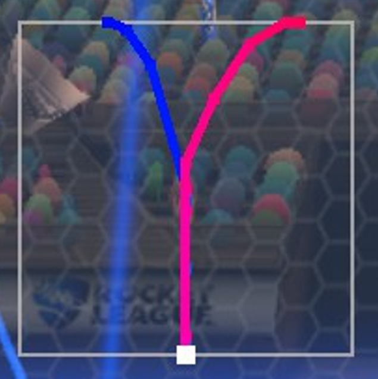
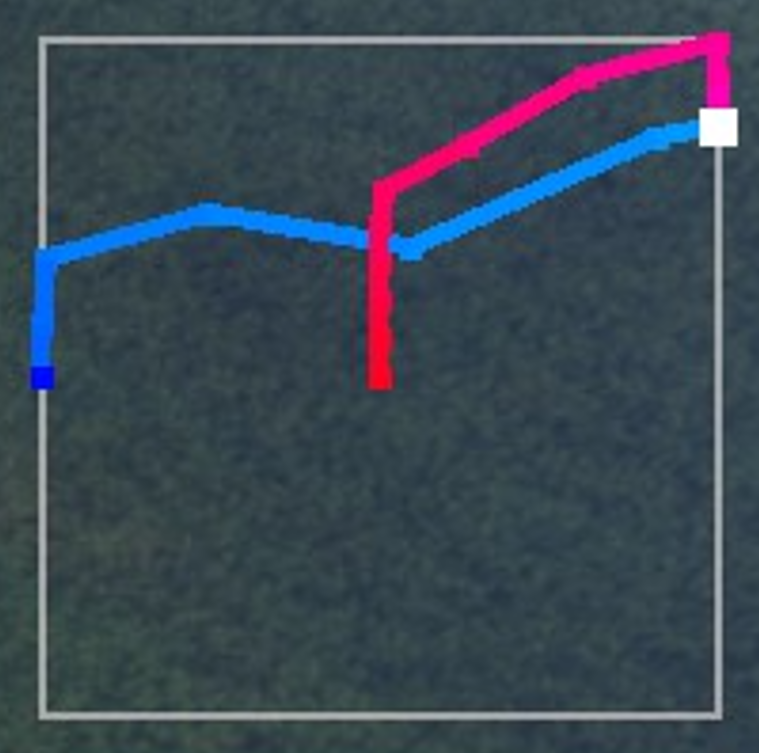

# JoystickViewer

This plugin provides additional features and customizability to the popular "JoystickSelfCheck" Bakkesmod plugin for Rocket League:

# Features:
- Capture and display a freeze-frame of joystick inputs immediately before and after a jump.
   - This is useful for improving flip cancels, stalls, and learning how joystick movements affect the car.
- Customize the location, size, color, gradient, and duration of the displayed inputs
- View the exact joystick inputs you make, checking drift, deadzone, etc.

I was inspired to make this after failing Maktuf resets and Mustys and stalls over and over and wanted to see exactly why :>

# Examples: 

1. Maktuf Reset  

   - The blue line represents inputs before the jump. It gets brighter as the time nears when the jump happened.
   - The pink line represents inputs after the jump. It gets more red as time advances further after the jump happened.
   - The white square represents the joystick input at the exact moment the jump registered.

2. Wall Dash  

   - Driving forward on the right side wall. Darker blue indicates a turn down the wall before the jump.
   - Lighter blue indicates turning back up the wall right before the jump, as well as a moderate forward tilt.
   - Pink shows that right after the jump, the joystick is tilted slightly further up before returning to neutral as time progresses.

# Known Issues
- In local matches with multiple cars, the history length and duration will be incorrect (too short)
   - This is b/c the function that's hooked to store inputs runs 120 times/s per locally handled car. 
   - For most modes (training, workshop, online games) this works since only the player's car is rendered locally.
   - For local matches with bots, the game renders the bots cars locally, so this function is called more.