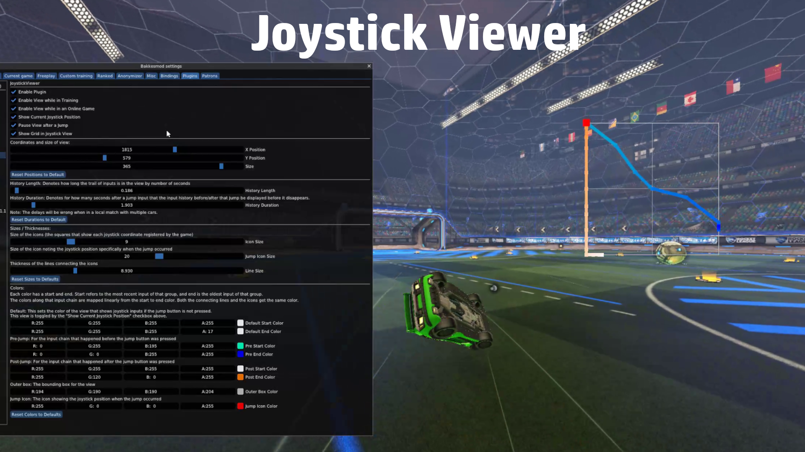

# JoystickViewer

This plugin provides additional features and customizability to the popular [JoystickSelfCheck](https://bakkesplugins.com/plugins/view/54) Bakkesmod plugin for Rocket League.

# Features:
- Capture and display a freeze-frame of joystick inputs immediately before and after a jump.
   - This is useful for improving flip cancels, stalls, and learning how joystick movements affect the car.
- Customize the location, size, color, gradient, and duration of the displayed inputs
- View the exact joystick inputs you make, checking drift, deadzone, etc.

# Similar Plugins
- [Joystick Visualization](https://bakkesplugins.com/plugins/view/516) by @Brotzeitsepp
   - Also adds features and customizability to the original [JoystickSelfCheck](https://bakkesplugins.com/plugins/view/54) by @AlpacaFlightSim
   - I created my plugin before realizing this one existed. 
   - @Brotzeitsepp's features additional options for showing aerial sensitivity adjustments and deadzone display, however it does not feature a freeze-frame when a jump occurs and lacks some customizability like line size and gradient display options

# Example: 
  

   - Blue indicates joystick inputs before the jump, getting brighter as it gets closer to the time of the jump  
   - Orange indicates inputs after the jump, getting brighter as time advances  
   - The green icon indicates the input when the jump occurred  
   - All these colors and sizes, and the number of inputs are customizable  

# Known Issues
- In local matches with multiple cars, the history length and duration will be incorrect (too short)
   - This is because the function that's hooked to store inputs runs 120 times/s per locally handled car. 
   - For most modes (training, workshop, online games) this works since only the player's car is rendered locally.
   - For local matches with bots, the game renders the bots' cars locally, so this function is called more.